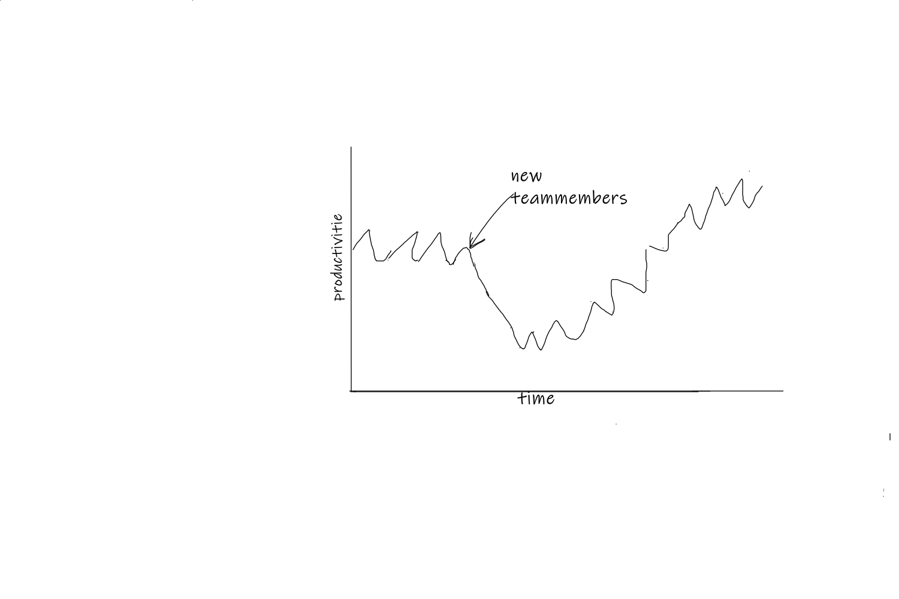

Written at {{date}} 

# {{title}}  

## common mistakes

- Het mangement en rest van het bedrijf wil niet 
- Geen retro met acties of daadwerkelijke verbeteringen 
- 

## Common mistakes

- Deadlines and tanking estimates as reals time 
- [Iron cross](##1-iron-cross)
- DOR & DOD
- Documentation 
- There is a plan 
- Not enough  information (like the business value)
- Only telling what they think the want instead of the problem they want to have solved 
- Not every one is equal 
- No room for refactoring and testing 
- No ownership of domains and services
- No interaction with the users 
 

Agile produces data and this data will most likely destroy the hope that every thing can be done in time. The velocity of a team is one of these metrics. And stile there are 'agile teams' that are not recording these metrics.

After a few sprints a lot of projects will see that the can't do every thing they hoped for in the in the beginning of the project. 

## For mangers.

 Velocity will remove hope and help to focus on the realistic outcome 

In Story points 

Planning acordenly but refine en dor en dod 

Hope let you say things like I think we are going fine  and should be able to make it in time But where is the data to support that?

How presice do you want your estemits the preciser the more time it will take to Come up with them. 

## For devs

Is software so it s should be easy to adjust a just weeks it would be Hardwsre 

Agile so it should flexible. And it can only be flexible if it's not too [complex.so](http://complex.so) we should aim for  simple am clear architecture. And to that simple weer should refactor a lot. Els it will become more complex over time.

But a comon thing that prevent this is fear

## Iron cross and Project management triangle

The iron cross of management:

These are the options for management to mange the project by making changes to the schedule, the scope, the qualities and the staff.

### adjusting the schedule 

So the usually means delaying the project. And often the stackholders of the project will say that that is interfering with bunnies reasons because that date was picked for a reason in the first place. ( often with  looking at a feasible this is )

### adding staff

A other option mangers often will think of is adding staff. But this will decrease the velocities of the teams in the beginning. A thing that is often not good understood. But new people will need help and guidance to get up to speed in a project. And that will take time from the old team members. While they are helping the new once they can't work on the other items.

